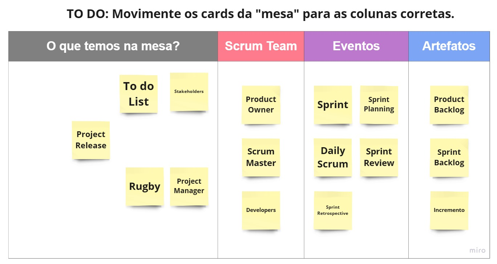

  <figure>
    
  </figure>
  <h1>Completando Framework SCRUM</h1>
  <H4></H4>

  
Prencheenchimento do Mapa Mental com o Pilares do SCRUM.
  <figure>
    
    <figcaption>Pilares: Os 3 pilares e os 5 valores do Scrum </figcaption>
  </figure>
  
Posicionar cada papel, evento e artefato corretamente.
  <figure>
    
    <figcaption>Pilares: 3 papéis, 5 eventos e 3 artefatos </figcaption>
  </figure>
  
Prencheenchimento do Frameword SCRUM com todos os Eventos, Artefatos e Papéis.
  <figure>
    
    <figcaption>Pilares: Os 3 pilares e os 5 valores do Scrum </figcaption>
  </figure>

  
Acesse o <a href='https://miro.com/app/board/uXjVMu1oiyA=/?share_link_id=359021526935'>arquivo</a>

<footer>
  

    <figure>
      
    </figure>
  

  

    
<small><i>Formação DIO.</i></small>

  

</footer>
