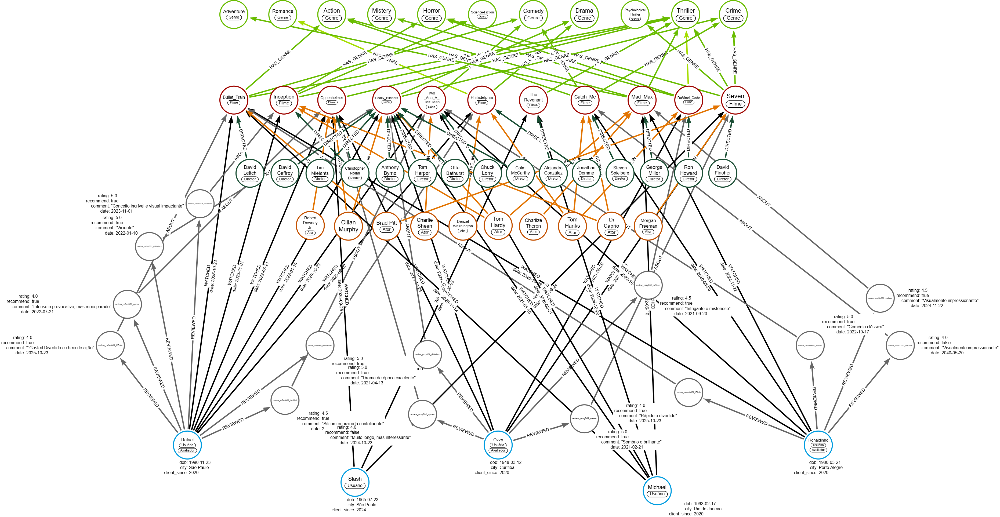

  <figure>
    
  </figure>
  <h1>Neo4J - Análise de Dados com Grafos</h1>

   

  

  <h3>Repositorio Para Projetos da <a href="https://web.dio.me/track/672a7491-d161-4bb8-b74c-44a2749f78ce">Bootcamp: Neo4j - Análise de Dados com Grafos</a></h3>

<h3>Desafio de Projeto: </h3>

Modelagem de Dados em Grafos de um Serviço de Streaming

Representação Gráfica do projeto:

</img>
