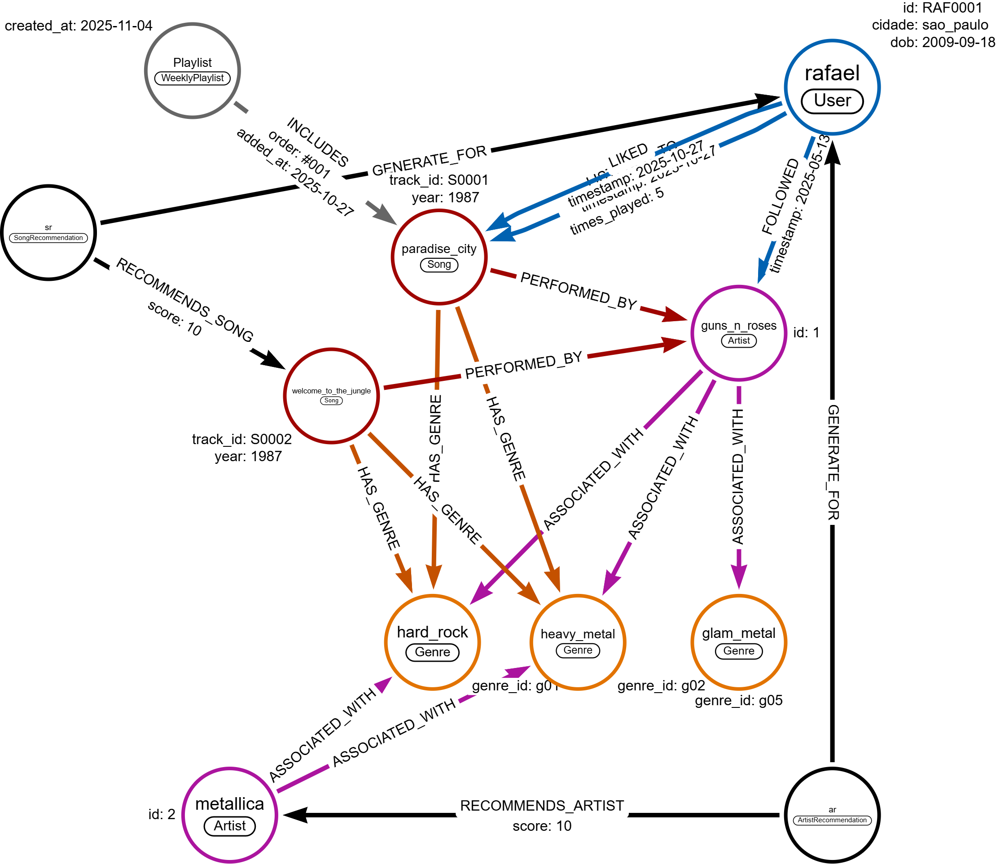

<picture>
  
</picture>

<h3>Desenvolvimento</h3>

Para enriquecer o grafo com dados mais precisos, foi utilizada a base de dados <a href="https://www.kaggle.com/datasets/undefinenull/million-song-dataset-spotify-lastfm" alt="Logotipo last.fm">Lastfm.csv</a>, originalmente disponível no <strong>Kaggle</strong>.

Essa base contém milhares de registros de interações entre usuários e músicas, incluindo escutas, curtidas e conexões com artistas. A partir dela, foi extraída uma amostra aleatória de 500 músicas, com o objetivo de simular o comportamento de cinco usuários fictícios.
 

Cada usuário foi associado a ações como ouvir e curtir faixas específicas, seguir determinados artistas que por sua vez estão relacionados a estilos musicais variados.
 

Essa abordagem permitiu construir um grafo representativo e funcional, capaz de refletir padrões de consumo musical e servir como base para recomendações personalizadas, análises de afinidade e geração de playlists semanais.

<h3>Tratamento dos Dados e Criação da Base de Referência</h3>

A construção da base de referência foi realizada em <strong>Python</strong> utilizando a biblioteca <strong>Pandas</strong>, com o objetivo de preparar os dados para importação no <strong>Neo4j</strong>.
 

Inicialmente, o arquivo CSV contendo os registros musicais foi carregado e inspecionado para garantir a integridade das colunas. Em seguida, foram aplicados tratamentos específicos: os gêneros musicais foram padronizados com o caractere "|" como separador, evitando conflitos com o delimitador de campos do CSV.

A coluna <i>timestamp</i> foi convertida para o formato de data ISO (aaaa-mm-dd), e <i>times_played</i> foi transformada em valor numérico. As demais colunas foram convertidas para string para garantir consistência na estrutura. Após esses ajustes, o arquivo foi exportado com vírgulas como separador de campos, resultando em uma base limpa, estruturada e pronta para ser utilizada como referência no grafo musical do <strong>Neo4j</strong>.

<h3>Carregamentos dos Dados Para o Neo4j</h3>
<picture>
  
</picture>

Com os dados prontos para serem trabalhados no <strong>Neo4j</strong>, o póximo passo foi a importação através da query:

<pre><code>LOAD CSV WITH HEADERS FROM "https://raw.githubusercontent.com/83Rafa/DIO._/refs/heads/main/Neo4J_Analise_de_Dados_com_Grafos/Modelagem_de_Dados_Em_Grafos/Projeto_2_Music_Recommendation/Docs/user_listened_data.csv" AS row
WITH row
MERGE (u:User {id: row.user_id})
MERGE (s:Song {track_id: row.track_id})
  SET s.song_name = row.song_name,
      s.year = toInteger(row.year)

MERGE (a:Artist {artist_name: row.artist})
MERGE (s)-[:PERFORMED_BY]->(a)

WITH row, u, s, a
UNWIND split(row.genre, "|") AS genre_name
MERGE (g:Genre {name: trim(genre_name)})
MERGE (s)-[:HAS_GENRE]->(g)
MERGE (a)-[:ASSOCIATED_WITH]->(g)

WITH row, u, s
MERGE (u)-[:LISTENED_TO {
timestamp: date(row.timestamp),
times_played: toInteger(row.times_played)
}]->(s)
</code></pre>

O código acima realiza a importação de dados a partir de um arquivo CSV hospedado no GitHub e transforma cada linha em uma estrutura de grafo dentro do <strong>Neo4j</strong>. Para cada registro, ele cria ou atualiza nós representando usuários, músicas, artistas e gêneros, conectando esses elementos por meio de relacionamentos que refletem suas interações.

As músicas são associadas aos artistas <i>(Artist)</i> que as interpretam e aos gêneros <i>(Genre)</i> que representam, enquanto os artistas  também são ligados aos mesmos gêneros para reforçar sua identidade musical. Os usuários <i>(User)</i> são conectados às músicas <i>(Song)</i> que escutaram por meio de um relacionamento que registra a data da escuta e o número de vezes que a faixa foi reproduzida. Com isso, o grafo resultante permite representar de forma consultável os hábitos de escuta, as preferências musicais e as conexões estilísticas entre artistas, faixas e ouvintes.

Esses elementos são conectados por relacionamentos que expressam suas interações: o usuário se conecta à música por meio de LISTENED_TO, que inclui informações como a data e a quantidade de reproduções; a música se liga ao artista com PERFORMED_BY; os gêneros são associados à música por HAS_GENRE e ao artista por ASSOCIATED_WITH. Essa modelagem permite representar de forma rica e consultável os hábitos de escuta, as preferências musicais e as conexões estilísticas entre artistas e faixas.

<h3>Sistema de Recomendação</h3>

Testei 3 ideias de playlists:

<strong>1. Playlist personalizada por afinidade de gênero</strong>

<strong>🔍 Objetivo: </strong>Criar uma playlist recomendada para um usuário com base nos gêneros que ele já escutou, excluindo músicas que ele já ouviu.

<strong>🧠 Como funciona: </strong>

<ul>
<li>A query começa identificando os gêneros das músicas que o usuario já escutou.</li>
<li>Em seguida, busca outras músicas que compartilham esses gêneros.</li>
<li>Filtra para garantir que o usuário ainda não ouviu essas musicas.</li>
<li>Retorna uma lista de recomendações personalizadas</li>
</ul>

<strong>📌 Aplicação: </strong>Ideal para montar uma playlist semanal, onde o sistema sugere novas faixas que se alinham com os gostos do usuário, mas que ainda não fazem parte do seu histórico.

<pre><code>
    MATCH (u:User {id: "U0001"})-[:LISTENED_TO]->(:Song)-[:HAS_GENRE]->(g:Genre)
    WITH u, collect(DISTINCT g.name) AS generos_favoritos

    MATCH (s:Song)-[:HAS_GENRE]->(g2:Genre)
    WHERE g2.name IN generos_favoritos
    AND NOT EXISTS {
    MATCH (u)-[:LISTENED_TO]->(s)
    }
    RETURN DISTINCT s.song_name AS recomendacao, g2.name AS genero
    LIMIT 10
</code></pre>

Retorna:

<pre><code>
    1 "Between You and Me" - "pop"
    2 "Miss You Love" - "pop"
    3 "Stay (I Missed You)" - "pop"
    4 "Babylon" - "pop"
    5 "Boys Boys Boys" - "pop"
    6 "Miniature Disasters" - "pop"
    7 "Revenge Is Sweeter (Than You Ever Were)" - "pop"
    8 "You're the First, the Last, My Everything" - "pop"
    9 "Will You Love Me Tomorrow?" - "pop"
    10 "Hanna" - "pop"
</code></pre>

  
<strong>2. Artistas mais ouvidos por todos os usuários</strong>

<strong>🔍 Objetivo: </strong>Rankear os artistas com maior número de reproduções no sistema, somando os plays de todos os usuários.

  
<strong>🧠 Como funciona: </strong>

  <ul>
  <li>A query percorre todos os relacionamentos LISTENED_TO entre usuários e músicas.</li>
  <li>Para cada música, identifica o artista correspondente.</li>
  <li>Soma o número de vezes que cada artista foi ouvido.</li>
  <li>Ordena os resultados para mostrar os mais populares.</li>
  </ul>
  
<strong>📌 Aplicação: </strong>Perfeito para gerar uma playlist semanal global, destacando os artistas mais escutados da semana — como um "Top 10 da comunidade".

<pre><code>
    MATCH (:User)-[r:LISTENED_TO]->(s:Song)-[:PERFORMED_BY]->(a:Artist)
    RETURN a.artist_name AS artista, sum(r.times_played) AS total_plays
    ORDER BY total_plays DESC
    LIMIT 10
  </code>
</pre>

Retorna: Artista - Qtt de vezes tocado

<pre><code>
1  "The Red Chord"     - 10
2  "Slowdive"          -  9
3  "Camera Obscura"    -  9
4  "The Magic Numbers" -  8
5  "Primus"            -  8
6  "Stevie Wonder"     -  8
7  "Hole"              -  6
8  "Insect Warfare"    -  6
9  "Morrissey"         -  6
10 "Amiina"            -  6
</code></pre>

<strong>3. Similaridade entre usuários</strong>

<strong>🔍 Objetivo: </strong>Encontrar usuários com gostos musicais semelhantes, com base nos gêneros que escutam.

<strong>🧠 Como funciona: </strong>

<ul>
<li>A query coleta os gêneros escutados por um usuário específico.</li>
<li>Compara esses gêneros com os de outros usuários.</li>
<li>Usa a função apoc.coll.intersection para medir o grau de sobreposição.</li>
<li>Retorna os usuários com maior afinidade de gosto.</li>
</ul>

<strong>📌 Aplicação: </strong>Para criar playlists colaborativas ou recomendações sociais, onde o sistema sugere músicas que pessoas com gostos parecidos estão ouvindo — como “Pessoas com seu gosto também gostaram de:”.

<pre>
  <code>
    MATCH (u1:User {id: "U0001"})-[:LISTENED_TO]->(:Song)-[:HAS_GENRE]->(g:Genre)
    WITH u1, collect(DISTINCT g.name) AS generos_u1

    MATCH (u2:User)-[:LISTENED_TO]->(:Song)-[:HAS_GENRE]->(g2:Genre)
    WHERE u2 <> u1
    WITH u2, collect(DISTINCT g2.name) AS generos_u2, generos_u1
    WITH u2, apoc.coll.intersection(generos_u1, generos_u2) AS intersecao
    WHERE size(intersecao) > 0
    RETURN u2.id AS usuario_similar, intersecao, size(intersecao) AS afinidade
    ORDER BY afinidade DESC
    LIMIT 5
  </code>
</pre>

Retorna: Usuário - Gêneros que ele ouve - Qtd de Afinidades

<pre><code>
"U0003" - ["blues_rock", "polish", "jazz", "cover", "experimental", "death_metal", "synthpop", "idm", "70s", "nu_metal", "house", "emo", "downtempo", "progressive_metal", "soul", "dance", "indie_rock", "electronic", "instrumental", "punk_rock", "hardcore", "grindcore", "punk", "metal", "trance", "psychedelic", "thrash_metal", "post_punk", "classic_rock", "gothic", "noise", "electro", "industrial", "female_vocalists", "60s", "hard_rock", "new_age", "britpop", "swedish", "new_wave", "trip_hop", "post_rock", "indie", "ska", "funk", "acoustic", "metalcore", "beautiful", "rap", "heavy_metal", "doom_metal", "british", "screamo", "country", "techno", "male_vocalists", "alternative_rock", "hip_hop", "indie_pop", "chillout", "90s", "chill", "rock", "german", "french", "pop", "love", "blues", "folk", "power_metal", "ambient", "grunge", "symphonic_metal", "00s", "japanese", "reggae", "80s", "avant_garde", "oldies", "classical", "psychedelic_rock", "black_metal", "post_hardcore", "mellow", "progressive_rock", "singer_songwriter", "piano", "alternative", "drum_and_bass", "lounge", "soundtrack"] - 91
</code></pre>

<h3>Conclusão do Projeto</h3>

Com a estrutura de grafo construída e os dados devidamente importados e conectados, já é possível implementar um sistema de recomendações eficaz baseado em afinidade de gêneros, popularidade de artistas e similaridade entre usuários. As consultas em Cypher permitem gerar playlists personalizadas, identificar padrões de escuta e sugerir novas faixas com base em comportamentos reais.
 

Embora técnicas de Machine Learning possam ser aplicadas para criar um sistema mais robusto — incorporando modelos preditivos, aprendizado colaborativo ou redes neurais —, para o propósito deste desafio, o projeto está concluído com sucesso. Ele cumpre seu papel de demonstrar como dados musicais podem ser modelados em grafos e utilizados para gerar recomendações inteligentes e contextualizadas.

Clique <a href="https://github.com/83Rafa/DIO._/tree/main/Neo4J_Analise_de_Dados_com_Grafos/Modelagem_de_Dados_Em_Grafos/Projeto_2_Music_Recommendation/Img">aqui</a> para acessar o banco de imagens do <strong>Neo4j Aura</strong>.

