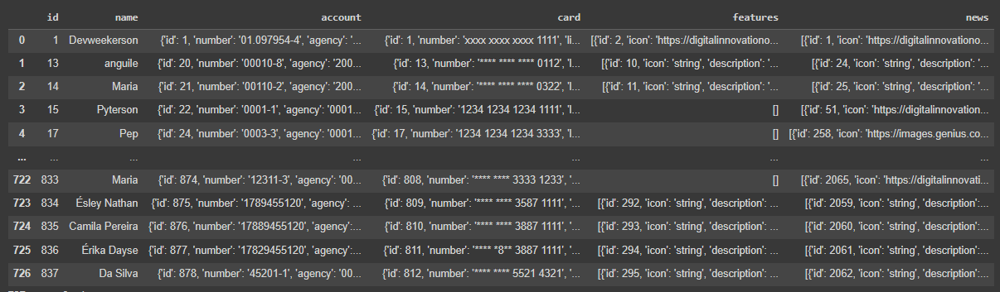
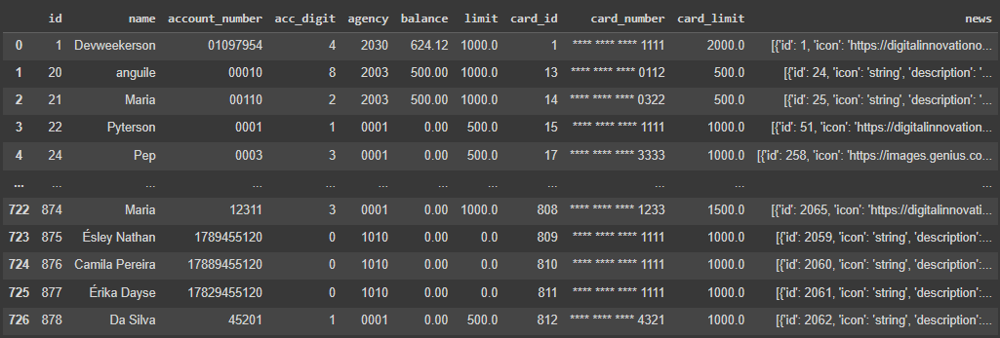
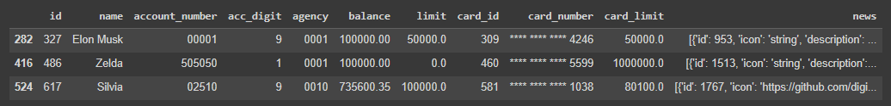
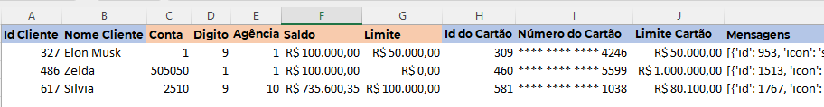

    <figure>
        
    </figure>
    <h1>
        Explorando IA Generativa em um Pipeline de ETL
    </h1>
     
     
    
Consumir os dados da API da Santander Dev Week 2023 e enviar mensagens personalizadas a "clientes" através da API do ChatGPT

    
<a href="https://github.com/83Rafa/DIO._/blob/main/Santander_Bootcamp_2023_Ciencia_de_Dados_Python/projeto_2/sdw2023.ipynb">Reprodução do Projeto</a> feito pelo expert.

    <h3>Projeto Repaginado</h3>
    
Acesse o arquivo <a href="https://github.com/83Rafa/DIO._/blob/main/Santander_Bootcamp_2023_Ciencia_de_Dados_Python/projeto_2/dio_sdw2023.ipynb">aqui</a>.

    
Para uma abordagem diferente foi realizada um a requisição <strong>GET</strong> de todos os usuários para poder analisar os dados até então enviados.

    
EXTRACT

    
A <strong>ETL</strong> foi realizada da seguinte maneira:

    <ul>
        <li>A Extração dos dados da API e conversão em uma tabela CSV.</li>
    </ul>
    <figure>
        
    </figure>

 

    
TRANSFORM

    <ul><li>Limpeza e formatação dos dados.</li></ul>
    <figure>
        
    </figure>
     
    
Com os passos a seguir:

    <ol>
        <li>Desmembramento da coluna <i>account</i> em <i>"id", "account_number", "account_digit", "agency", "balance" e "limit"</i>I></li>
        <li>Desmembramento da coluna <i>"card"</i> em "card_id", "card_number", e "card_limit"</li>
        <li>Remoção de dados estranhos às colunas de "acc_number", "acc_digit", "agency" e "card_number</li>
        <li>Preenchimento de dados nulos nas colunas "account_number' e "digit"</li>
        <li>Foi realizado um teste para envio de mensagens para 3 <i>'users'</i>. No caso os 3 usuários com saldo bancário acima de 100.000.</li>
        
O ChatGPT da versão <strong>"gpt-3.5-turbo"</strong> limita o envio de 3 mensagens a cada 3 minitos. A função <i>sleep()</i> do pacote nativo do python <strong>Time</strong> poderia automatizar o envio para mais usuários caso fosse necessário.
        <li>Para gerar o filtro de ids foi criada a função <i>"extract_ids_and_names"</i> quer retorna a lista de usuários que se encaixa no perfil desejado.</li>
    </ol>

    
LOAD

    
A partir desse ponto, com os ids desejados em mãos, o código do expert foi aproveitado tanto para buscar as informações dos usuários em formato <stront>JSON</strong> da API da <strong>Santander Dev Week</strong> quanto para acessar a API do <strong>ChatGPT</strong> e enviar as mensagens personalizadas.

    <figure>
        
    </figure>
    
Também foram gerados um arquivo CSV de uma tabela com os dados tratados e outra tabela apenas com os 3 clientes que receberam as mensagens.

    <figure>
        
    </figure>

<footer>
  

    <figure>
      
    </figure>
  

  

    
<small><i>Formação DIO.</i></small>

  

</footer
